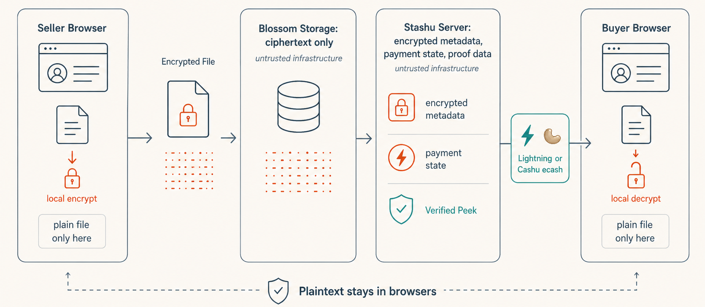
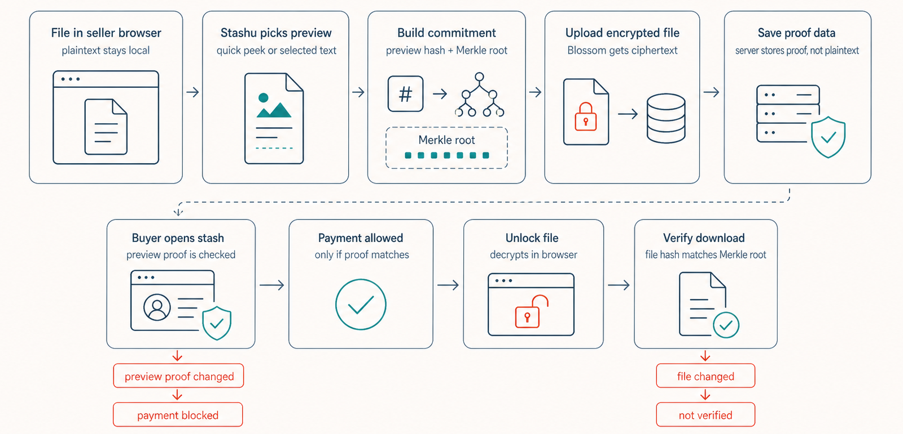

<div align="center">
  
  <h1>Stashu</h1>
  <p>
    <strong>Sell encrypted files for sats with previews buyers can verify.</strong>
  </p>
  <p>
    <a href="https://stashu.tech">Website</a> &middot;
    <a href="#how-it-works">How it works</a> &middot;
    <a href="#verified-peek">Verified Peek</a> &middot;
    <a href="#security-model">Security</a>
  </p>
</div>

---

## Why Stashu?

Stashu is a privacy-first pay-to-unlock file marketplace. Sellers create a stash
in the browser, buyers unlock it with Lightning or Cashu ecash, and no platform
account is required.

- **Client-side encryption** - files are encrypted in the browser before upload.
- **Blossom storage** - encrypted blobs are stored on Blossom servers instead of
  inside the app database.
- **Verified Peek** - optional previews are generated from the file itself and
  checked again after unlock.
- **Nostr seller identity** - sellers use a local Nostr keypair and NIP-98 auth,
  with no passwords or sessions.
- **Sats-native unlocks** - buyers can pay with a Lightning invoice or a Cashu
  token.
- **Self-hostable** - run the client, server, database, and preferred Blossom
  setup yourself.

## How It Works

<div align="center">
  
</div>

1. **Seller creates a stash** - selects a file, title, price, and optional buyer
   preview.
2. **Browser encrypts the file** - plaintext stays local. The encrypted blob is
   uploaded to Blossom.
3. **Server stores stash state** - encrypted metadata, payment state, and preview
   proof data are saved in SQLite.
4. **Buyer opens the stash** - public metadata and any Verified Peek data are
   loaded before payment.
5. **Buyer pays** - either by paying a Lightning invoice or pasting a Cashu ecash
   token.
6. **Browser unlocks the file** - after payment, the server returns the decryption
   material, and the buyer browser decrypts and verifies the download locally.

## Verified Peek

Verified Peek adds a buyer-side integrity check. If a seller shows a preview, it
is generated from the selected file in the browser, then tied to the same
encrypted content the buyer unlocks later.

<div align="center">
  
</div>

What it gives buyers:

- Preview text is generated from the selected file in the seller's browser.
- The buyer page checks the published preview proof before enabling payment.
- After payment, the decrypted file is checked against the same content
  commitment before the download is shown as verified.
- If the preview proof or unlocked file does not match, Stashu blocks payment or
  marks the download as not verified.

Under the hood:

- The browser serializes the generated preview and hashes it.
- The file is committed with a Merkle-style root over file chunks.
- If text is shown publicly, that exact range gets an inclusion proof.
- The final proof root ties the preview hash to the content root.
- The server stores the proof data, but the proof secret needed for the final file
  check is returned only after unlock.

For now, public previews are generated for text-like files. Other file types still
get a no-public-preview commitment check after unlock.

## Tech Stack

| Layer      | Technology                                |
| ---------- | ----------------------------------------- |
| Frontend   | React 19, Vite, TypeScript, TailwindCSS 4 |
| Backend    | Hono, TypeScript, better-sqlite3          |
| Database   | SQLite with WAL mode and foreign keys     |
| Storage    | Blossom                                   |
| Encryption | XChaCha20-Poly1305 with `@noble/ciphers`  |
| Payments   | Cashu ecash and Lightning                 |
| Identity   | Local Nostr keypair with nsec recovery    |
| Auth       | NIP-98 HTTP Auth                          |

## Security Model

Stashu V1 is a trusted escrow. In the normal flow, plaintext files stay
client-side, but the server still coordinates payment and returns the file key
after a valid unlock.

### Protected Today

- **Plaintext file contents** stay in the seller and buyer browsers during normal
  use. Blossom stores ciphertext.
- **Sensitive database fields** are encrypted at rest, including stash metadata,
  blob URLs, file keys, preview proof fields, seller payment tokens, and Lightning
  addresses.
- **Verified Peek integrity** checks that a public preview belongs to the committed
  file, then checks the unlocked file again after payment.
- **Seller auth** uses NIP-98 signatures from the seller's local Nostr keypair.
- **Payment integrity** uses quote-to-stash binding, processing locks, and
  idempotent unlock paths to guard against replay and double-processing bugs.
- **Rate limiting** protects public unlock, payment, stash, and seller routes.

### Known Limits

| Limit                  | Details                                                                                                                                             |
| ---------------------- | --------------------------------------------------------------------------------------------------------------------------------------------------- |
| Trusted server         | The server currently stores encrypted file keys and decides when to release them after payment.                                                     |
| Server compromise      | `TOKEN_ENCRYPTION_KEY` is co-located with the database. A root compromise can decrypt encrypted database fields.                                    |
| Payment custody        | Seller Cashu tokens are held by the server until withdrawal or auto-settlement.                                                                     |
| Browser key storage    | The seller Nostr private key lives in browser local storage.                                                                                        |
| Preview privacy        | Verified Peek reveals the selected preview before payment. Stashu uses conservative defaults and limits, but the seller still chooses what to show. |
| Single mint dependency | The server currently uses one configured Cashu mint through `MINT_URL`.                                                                             |

## Quick Start

```bash
git clone https://github.com/keshav0479/Stashu.git
cd Stashu
npm install

cp server/.env.example server/.env
# Generate TOKEN_ENCRYPTION_KEY:
# node -e "console.log(require('crypto').randomBytes(32).toString('hex'))"

cp client/.env.example client/.env

npm run dev
```

- Client: http://localhost:5173
- Server: http://localhost:3000

## Environment

Server:

- `TOKEN_ENCRYPTION_KEY` - 64 hex chars. Required.
- `MINT_URL` - Cashu mint URL.
- `CORS_ORIGINS` - comma-separated allowed origins.
- `PORT` - server port. Defaults to `3000`.
- `DB_PATH` - SQLite database path.
- `TRUSTED_PROXY` - set to `1` only when running behind a trusted proxy.

Client:

- `VITE_API_URL` - server API URL.
- `VITE_BLOSSOM_URL` - default Blossom server URL.

## Development

```bash
# Run client and server
npm run dev

# Build both workspaces
npm run build

# Run all tests
npm run test

# Run one side
npm run test --workspace=server
npm run test --workspace=client
npm run lint --workspace=client

# Docker
docker compose up --build
```

## Roadmap

### V1: Trusted Escrow

- [x] Client-side file encryption
- [x] Blossom-backed encrypted file storage
- [x] Cashu and Lightning unlocks
- [x] Nostr keypair seller auth
- [x] Seller dashboard, withdrawal, and auto-settlement
- [x] Storefront publishing controls
- [x] Verified Peek for text-like files
- [ ] Rich previews for images, PDFs, and archives
- [ ] Stash lifecycle controls for editing, unpublishing, and deleting
- [ ] Clearer fee estimates before withdrawal

### V2: Trust-Minimized

- [ ] **NIP-44 key exchange** - move file-key delivery away from server-readable
      escrow.
- [ ] **NUT-11 P2PK tokens** - lock Cashu payments to the seller's key so the
      server cannot spend seller funds.
- [ ] **Multi-mint support** - let buyers and sellers work across more than one
      configured mint.

## Contributing

See [CONTRIBUTING.md](CONTRIBUTING.md) for setup instructions, testing, and PR
guidelines.

## License

MIT
